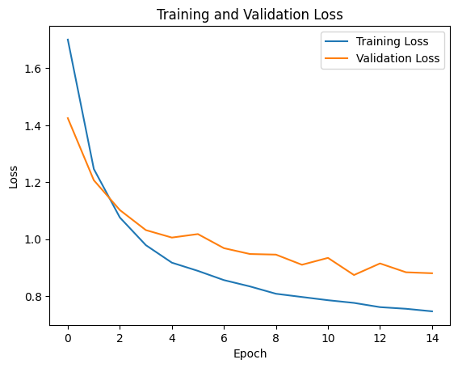

# TC3002B_M2

Proyecto para el Módulo 2 de "Desarrollo de aplicaciones avanzadas de ciencias computacionales". En este, se realizará un modelo el cual se entrenará con imágenes de paisajes para que, posteriormente, pueda identificar imágenes pertenecientes a estos.

## Contenido del *Dataset*

El *dataset* a utilizar fue obtenido de [*Kaggle*](https://www.kaggle.com/datasets/utkarshsaxenadn/landscape-recognition-image-dataset-12k-images/data) y pertenece al usuario ***DeepNets***

Originalmente, este contiene imágenes de diferentes paisajes separados en 5 clases:

* Costa.
* Desierto.
* Montañas.
* Glaciar.
* Bosque.

Las imágenes son variadas en su forma, algunas contienen elementos como marcas de agua o bordes en las esquinas.

Estas imágenes se encontraban divididas en 3 subdirectorios conteniendo diferentes cantidades de archivos en cada uno; dentro del directorio *training* habían 2000 imágenes por cada clase mientras que en *testing* solamente habían 100 por cada una de las divisiones.

Para asegurar una correcta distribución de 80% a 20%, todas las imágenes contenidas en la carpeta *testing* fueron movidas a *training* para, posteriormente, renombrarlas y mover 420 imágenes por clase a *testing* terminando así con:

* *Testing*: 420 imágenes por clase.
* *Training*: 1680 imágenes por clase.

De momento, las 300 imágenes por clase almacenadas en la carpeta *validation* se reservarán para un futuro uso en caso de ser necesarias.

## Modelo

Se decidió decidió hacer *transfer learning* haciendo uso de ***InceptionV3*** sin incluir la capa del modelo original al querer que entrene en capas personalizadas.

### Versión 1

Como modelo base se utiliza ***InceptionV3***, posteriormente se utilizan las siguientes capas personalizadas:

* Se aplica una capa de ***pooling* global** promedio para reducir la dimensionalidad de la salida del modelo base y obtener características globales de las imágenes.
* Se agrega una **capa densa** con 256 neuronas y activación ReLU para extracción y transformación.
* se agrega una **capa densa** de salida con 5 neuronas y activación softmax, que produce la distribución de probabilidad sobre las 5 clases de salida.

### Versión 2

Aparte de darle un nombre personalizado a las capas de la arquitectura, una de las principales diferencias con respecto a la anterior radica en el constante ajuste de las capas, es decir, los pesos de las capas variarán durante el entrenamiento.
Aparte de esto, se hacen algunos cambios en capas:

* Se agrega una capa de ***flatten***.
* Se actualiza la **capa densa** para que ahora tenga 512 neuronas.
* Se añade una capa de ***dropout*** para apagar el 50% de las neuronas de forma aleatoria.
Con estos cambios, se tiene un resultado de *accuracy* mayor, pero, el tiempo de entrenamiento aumenta considerablemente.

### Justificación

Si bien inicialmente se planeaba utilizar **MobileNetV2** como el artículo de *"Landscape Classification"*, la investigación de *"Classifying Tourists’ Photos"* me llevó a considerar hacer el cambio a **InceptionV3**.
Aunado a todo esto, decidí mantener una arquitectura similar a la de los ejemplos vistos en clase más que nada para no generar una arquitectura que esté o simplificada o sea robusta en exceso.

Al final, se decidió hacer una nueva versión la 2 en la cual se impedía que las capas pudieran ser entrenadas, más que nada con fines de comparación.

**NOTA:** Los modelos entrenados se encuentran guardados en la [Carpeta de *Drive*](https://drive.google.com/drive/folders/1MYSXEZ1Kj9biLE9t6nm71JLbR2NCDUnU?usp=sharing)

## Resultados

### *Accuracy* vs *Loss*

Al tener imágenes de validación, estas fueron ocupadas durante el entrenamiento para ir monitoreando que el modelo no presentara casos serios ni de *overfitting* o de *underfiting*.

Durante el primer modelo, resultaba imposible subir la *accuracy* del mismo sin importar el número de épocas con el que se daba, sin embargo, puede notarse que de los 3 modelos, este es el que muestra menores picos tanto en el *loss* como *accuracy* cuando se hacía uso de los datos de *validation*.

A continuación se puede observar que al permitirle entrenar las capas a la versión 2, permitió obtener un *accuracy* mayor en un menores épocas respecto al otro modelo de la versión 2, de igual forma, puede verse que los resultados de *loss* y *accuracy* de *validation* presentan picos más pequeños en en la versión en la cual las capas pueden ser entrenadas con respecto a la que no.

#### Versión 1

  
  

#### Versión 2

  
  

#### Versión 2 (Sin Capas Entrenables)

  
  

### Matriz de Confusión

  <figure style="width: 50%; margin: 0;">
    
    <figcaption style="text-align: center;">Modelo v1</figcaption>
  </figure>
  <figure style="width: 50%; margin: 0;">
    
    <figcaption style="text-align: center;">Modelo v2</figcaption>
  </figure>
  <figure style="width: 50%; margin: 0;">
    
    <figcaption style="text-align: center;">Modelo v2 (Sin Capas Entrenables)</figcaption>
  </figure>

Si se analiza la matriz de confusión obtenida de todos los casos utiloizados en *training*, se puede observar que el modelo 2 presenta un mayor acierto cuando se le permite entrenar a las capas, sigue cometiendo falsos positivos, pero, estos no pasaban a ser más de 100.

### Muestreo de Predicciones

Para obtener mayor información sobre la forma en la que estaba haciendo las predicciones después del entrenamiento, se imprimieron los resultados que obtenía y el grado de confiabilidad que para clasificar las imágenes en alguna de las 5 clases.

Versión 1

Versión 2 **con** capas entrenables

Versión 2 **sin** capas entrenables

Como la muestra contiene imágenes de forma un tanto aleatoria, no se pueden comparar las mismas imágenes para todos los modelos, sin embargo, puede notarse que el modelo en cualquiera de sus versiones tiene problemas para identificar correctamente un escenario si este parece presentar características de otros y esto se da principalmente por la clasificación de las imágenes en el *dataset*.

Por ejemplo, una imagen que contiene árboles y está en la carpeta de *mountain* puede ser clasificada erróneamente como *forest* y de forma visceversa.

### Predicciones

Los siguientes resultados muestran el grado de confianza que poseen los modelos cuando se debe de hacer una predicción de cualquiera de los 5 paisajes. Todos estas imágenes fueron descargadas directamente de internet en una carpeta con el nombre de *predictions*, después, se invoca al modelo para que evalúe una por una hasta terminar.

Versión 1

Versión 2 **con** capas entrenables

Versión 2 **sin** capas entrenables

Como puede observarse, el modelo con capas entrenables registró casi todas las imágenes con un gran acierto en confiabilidad, sin embargo, al igual que en el modelo de versión 1, se puede notar un error en la primera imagen de la tercera fila. El modelo debería de reportar que se trata de un bosque, sin embargo, lo reporta como montaña.

Como se reportó con anterioridad, algunas imágenes de montaña son similares a esta y es por eso que al modelo le cuesta clasificar imágenes de este tipo correctamente.

## Links de Interés

[*Dataset* de *Kaggle*](https://www.kaggle.com/datasets/utkarshsaxenadn/landscape-recognition-image-dataset-12k-images/data)

[Carpeta de *Drive* con imágenes del proyecto](https://drive.google.com/drive/folders/1MYSXEZ1Kj9biLE9t6nm71JLbR2NCDUnU?usp=sharing)

## Recursos Bibliográficos

* Buscombe D, Ritchie AC. Landscape Classification with Deep Neural Networks. Geosciences. 2018; 8(7):244. https://doi.org/10.3390/geosciences8070244
* Kim, J., Kang, Y., Cho, N., & Park, S. (2021). Classifying Tourists’ Photos and Exploring Tourism Destination Image Using a Deep Learning Model. Abstracts of the ICA, 3, 150.
